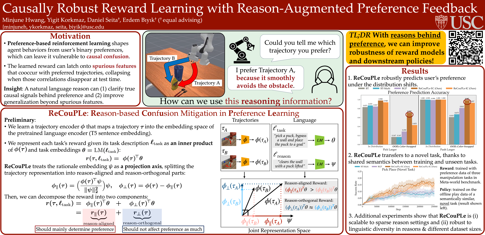

# Causally Robust Reward Learning from Reason-Augmented Preference Feedback

[](https://www.python.org/)
[](./LICENSE)

This repository provides the official implementation of the paper:

> **Causally Robust Reward Learning from Reason-Augmented Preference Feedback**  
> Minjune Hwang, Yigit Korkmaz, Daniel Seita†, Erdem Bıyık†  
> **ICLR 2026**

-----

## Overview

PbRL is widely used for shaping agent behavior to match a user's preference, yet its sparse binary feedback makes it vulnerable to causal confusion. We introduce **ReCouPLe**, a lightweight framework that uses **natural language rationales** to clarify true causal signals behind preference and to improve generalization, by employing orthogonal decomposition.

<p align="center">
  
  <br>
  <em>Summary of ReCouPLe framework and results. <a href="assets/ICLR2026_ReCouPLe_poster.pdf">Click here for the full PDF version.</a></em>
</p>

> [\!NOTE]  
> **Codebase Under Construction**: The core implementation for ReCouPLe is available. Detailed guides and scripts for extra experiments (ablations and appendix tasks) added during the rebuttal period are currently being integrated and will be pushed soon.

-----

## Environment Setup

  * **Python**: 3.9
  * **Dependencies**: Specified in `./recouple/environment_gpu.yaml`
  * **Simulators**:
      * Metaworld (requires `gym==0.23.0`)
      * ManiSkill3

-----

## Code Structure

  * **ManiSkill environments (RQ1)**: `./ManiSkill3/envs`
  * **Metaworld environments (RQ2)**: `./ManiSkill3/envs`
  * **Core algorithms**: `./recouple/research/algs`
      * **ReCouPLe-EC**: `./recouple/research/algs/rpl_proj_eq.py`
      * **ReCouPLe-IC**: `./recouple/research/algs/rpl_proj_2bt.py`
      * **BT (baseline)**: `./recouple/research/algs/piql.py`
      * **BT-Multi (baseline)**: `./recouple/research/algs/mtpiql.py`
      * **RFP (baseline)**: `./recouple/research/algs/rpl.py`
      * **IQL (offline RL policy learning)**: `./recouple/research/algs/offline/iql.py`

-----

## Sample Experiment Procedure (RQ2 Metaworld)

1.  **Collect trajectories**:

    ```sh
    python scripts/create_metaworld_dataset.py --env push-wall-v2 --path push-wall-v2-valid
    ```

2.  **Create preference dataset with reasons**:

    ```sh
    python scripts/create_metaworld_comparison_dataset_with_reason.py --envs pick-place-v2 --paths pick-place-v2 --output comparison_dataset --seed 1
    python scripts/create_metaworld_comparison_dataset_with_reason.py --envs pick-place-wall-v2 push-v2 push-wall-v2 --paths pick-place-wall-v2 push-v2 push-wall-v2 --output comparison_dataset --seed 1
    ```

3.  **Run training jobs**:

    ```sh
    sh metaworld_jobs/recouple_eq.sh
    ```

-----

## Acknowledgement

This codebase is developed on top of [research-lightning](https://github.com/jhejna/research-lightning), a lightweight lightweight policy learning research framework in pytorch, developed by [Joey Hejna](https://joeyhejna.com/). 

-----

## Citation

```bibtex
@inproceedings{
    hwang2026causally,
    title={Causally Robust Reward Learning from Reason-Augmented Preference Feedback},
    author={Hwang, Minjune and Korkmaz, Yigit and Seita, Daniel and Bıyık, Erdem},
    booktitle={International Conference on Learning Representations (ICLR)},
    year={2026}
}
```